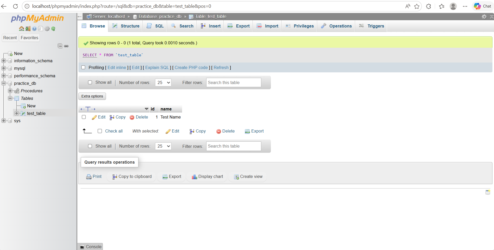

# PHPMyAdmin Database Activity

## Overview
This project demonstrates creating a database, table, and stored procedure using phpMyAdmin in a local AMPPS environment.

## Steps Completed
- Started Apache and MySQL using AMPPS
- Accessed phpMyAdmin via localhost
- Created a database named `practice_db`
- Created a table named `test_table`
- Created a stored procedure `add_name`
- Executed the procedure to insert "Test Name"
- Verified the inserted data in the table

## Result
The screenshot below shows the successful insertion of data into the table.

